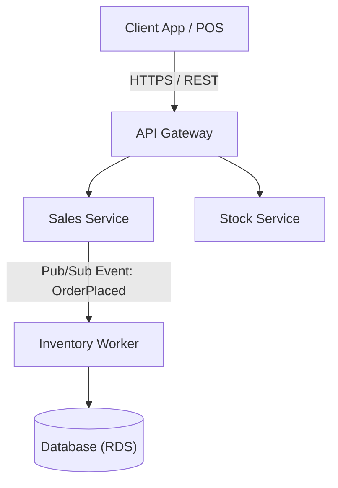
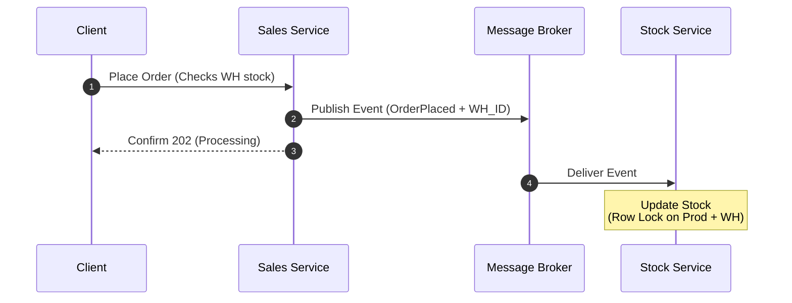
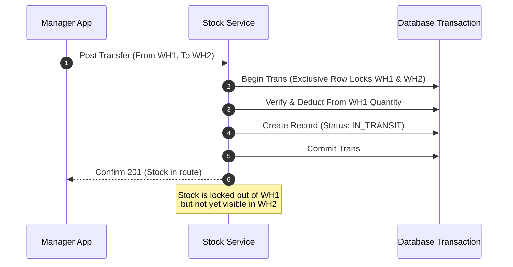

# Title: System architecture
# type: ARCHITECTURE
# version: 1.0
# status: ACTIVE
# effectivedate: 03/09/2026

## System Architecture & Components

The system utilizes a **Microservices Architecture** driven by asynchronous events to ensure the checkout process remains fast even during peak traffic hours.



### Component Breakdown

*   **API Gateway:** Routes incoming traffic, handles user authentication, and applies rate limiting.
*   **Sales Service:** Manages customer shopping carts, processes payments, captures the targeted fulfillment warehouse ID, and emits checkout events.
*   **Stock Service:** Manages product catalogs, centralized inventory levels distributed across warehouses, physical facility profiles, and inventory transfer states.
*   **Inventory Worker:** A background service that listens for sales and transfer events to safely manipulate stock levels across warehouses.

## Key Workflows

### Workflow A: The Checkout & Multi-Warehouse Stock Update Sequence
To keep the UI responsive, the checkout process decouples the payment from the inventory deduction using an asynchronous event queue. The warehouse location is locked in during the initial routing check.



1.  **Initiation:** The client submits a payload to `/api/v1/sales/checkout`. The payload includes requested products and the designated source `warehouse_id`.
2.  **Validation:** The Sales Service verifies payment capability and logs a `PENDING` order record mapped to the assigned warehouse.
3.  **Event Emission:** The Sales Service publishes an `OrderPlaced` event containing the order details, product IDs, quantities, and the `warehouse_id`. It instantly returns a `202 Accepted` status to the client.
4.  **Stock Reconciliation:** The Inventory Worker consumes the event, opens a database transaction, and isolates the target record using a localized row lock:
    ```sql
    SELECT quantity FROM stock_levels 
    WHERE product_id = \$1 AND warehouse_id = \$2 
    FOR UPDATE;
    ```
5.  **Deduction:** The worker decrements the `stock_levels.quantity` for that precise warehouse location, preventing cross-warehouse race conditions.

### Workflow B: Inter-Warehouse Inventory Transfer
Moving inventory safely requires a two-phase transaction pattern to prevent stock from vanishing or being double-counted while physically on a truck between locations.



#### Phase 1: Dispatch (`IN_TRANSIT`)
1. An administrator creates an inventory transfer tracking payload specifying `from_warehouse_id`, `to_warehouse_id`, `product_id`, and `quantity`.
2. The Stock Service initiates a database transaction and obtains row locks on the source product-warehouse row.
3. The system checks if the source warehouse possesses sufficient stock. If valid, the exact allocation quantity is decremented from the source warehouse's `stock_levels` row.
4. The system inserts an `inventory_transfers` record set to `IN_TRANSIT` and commits the transaction. This ensures stock is removed from circulation but globally recorded as "in flight."

#### Phase 2: Receipt (`COMPLETED`)
1. Upon physical arrival at the destination warehouse, the receiving manager triggers the `/api/v1/transfers/{id}/receive` endpoint.
2. The Stock Service launches a transaction and acquires an exclusive row lock on the destination row inside `stock_levels`.
3. The destination warehouse's `quantity` is incremented by the transfer amount.
4. The transaction shifts the `inventory_transfers.status` flag to `COMPLETED` and commits, cleanly completing the audit trail.

