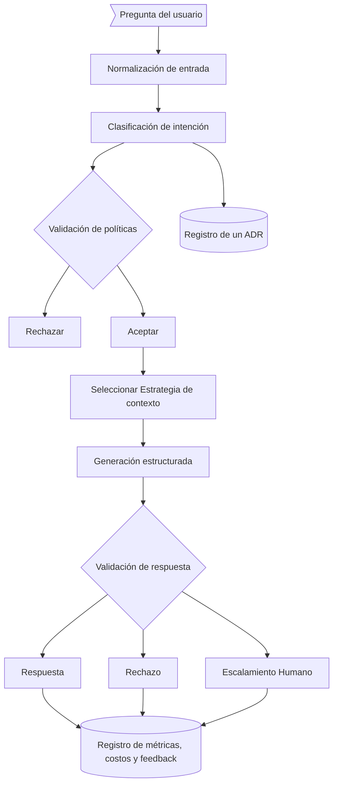

## Diagrama inicial

| Etapa                                  | IA o Determinista | Por que                                                                                                                                                                                                                                                                                                                                                               |
|:---------------------------------------|-------------------|-----------------------------------------------------------------------------------------------------------------------------------------------------------------------------------------------------------------------------------------------------------------------------------------------------------------------------------------------------------------------|
| Normalización de entrada               | Determinista      | De acuerdo al model y proveedor ver parametros 
| Clasificación de intención             | IA                | Le damos las categorias y su descripcion y pedimos clasifique intencion al LLM.                                                                                                                                                                                                                                                                                       |
| Validación de políticas                | Determinista      | Una vez sabemos la intencion podemos aplicar las politicas, por ejemplo escalar si hay conflictos, si hay ADR involucaradas tenemos owners a quien escalar.                                                                                                                                                                                                           |
| Seleccion de la Estrategia de Contexto | Determinista      | Si la intencion es explicar un detalle tecnico podemos agregar al contexto el glosario tecnico, quiza tambien dar directivas, por ejemplo para `LOCATE_SOURCE` dar una instruccion que algun documento debe ser devuleto.                                                                                                                                             |
| Generacion Estructurada                | IA                | LLamada al LLM                                                                                                                                                                                                                                                                                                                                                        |
| Validacion de la respuesta             | Hibrida           | Pedimos al LLM chequear consistencia factual contra los ADRs y documentacion, tambien podriamos usar la confidencia para rechazar la respuesta. De acuerdo a la intencion podriamos validar el output, por ejemplo para LOCATE_SOURCE el output deberia referenciar algun documento o ADR. Tambien podriamos evaluar intencion para rechazar decisiones y ambiguedad (Guardians) |
| Registro                               | Determinista      | Registramos estadisticas de tokens, latencia, confidencia (usar confidencia para rechazar respuestas?)                                                                                                                                                                                                                                                                |
|                                        |                   |                                                                                                                                                                                                                                                                                                                                                                       |

